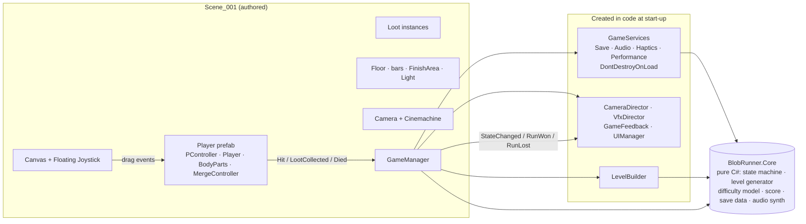
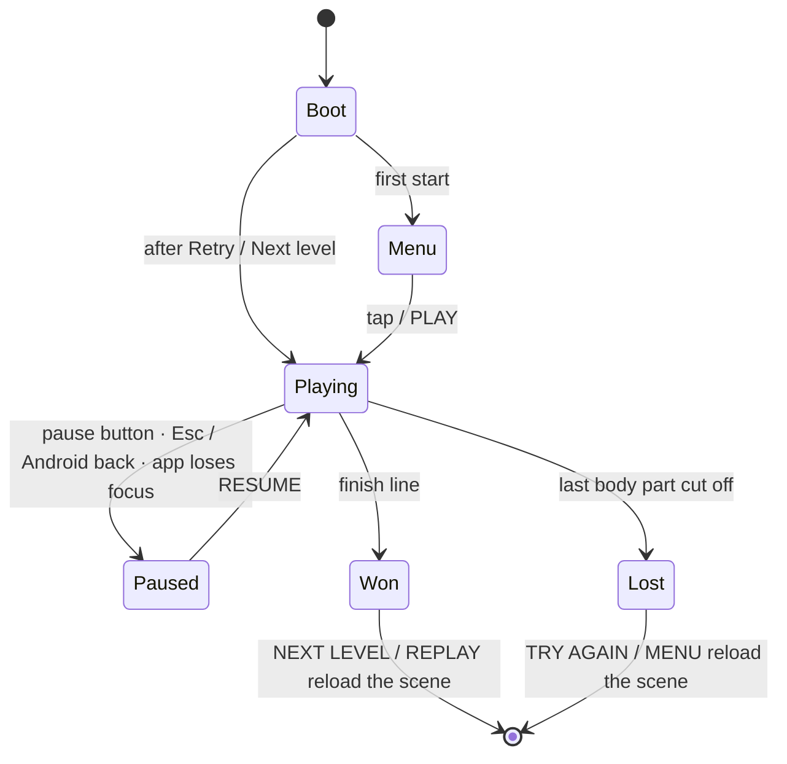

# Architecture

## 1. Big picture



Design rules that shape the code:

* **Pure logic lives in `BlobRunner.Core`** (an assembly with *no* Unity reference). It is unit tested and could be reused by a server or a tool.
* **Scene objects stay authored; new systems are created in code** (`GameManager.Awake`, `GameServices`). The scene and prefabs therefore needed only a handful of tiny, validated edits, and nothing has to be wired up by hand in the Inspector.
* **Gameplay classes do not know about effects.** They raise events; [`GameFeedback`](../Assets/_Main/Scripts/Effects/GameFeedback.cs) is the single place that maps events to sound, particles, haptics, camera and UI feedback.
* **A run is restarted by reloading the scene.** That resets every object at once; the long lived services survive the reload (no audio re-synthesis, no save re-read).

## 2. Assemblies and folders

| Assembly | Folder | Contents |
|---|---|---|
| `BlobRunner.Core` (`noEngineReferences`) | `Assets/_Main/Scripts/Core` | `GameStateMachine`, `LevelGenerator`, `DifficultyModel`, `LevelPlan`, `ScoreCalculator`, `SaveData`, `AdaptiveQualityGovernor`, `ProceduralSynth`, `Rng`, enums |
| `Assembly-CSharp` | `Assets/_Main/Scripts/**` (everything else) | gameplay, services, effects, levels, UI |
| `BlobRunner.Tests.EditMode` | `Assets/_Main/Tests/EditMode` | NUnit tests for `Core` |
| third party | `Assets/Plugins`, `Assets/Joystick Pack`, `Assets/Graphy …`, `Assets/uRaymarching`, `Assets/uShaderTemplate` | see [THIRD_PARTY.md](THIRD_PARTY.md) |

Game code stays in `Assembly-CSharp` on purpose: the touch joystick and the DOTween UI modules (both plain scripts) are not reachable from another assembly definition.

```
Assets/_Main
├── Scripts
│   ├── Core            pure logic (asmdef)
│   ├── GamePlay        Player, PController, BodyPart, LootContainer, MergeController, JellyContainer, PAnimationController
│   ├── Managers        GameManager (state, scoring, progression, restart)
│   ├── Services        GameServices, SaveService, AudioDirector, HapticsService, PerformanceDirector
│   ├── Effects         VfxDirector, CameraDirector, CameraShakeExtension, GameFeedback, BlobShadow, ProceduralTextures
│   ├── Levels          LevelBuilder, LevelTheme (+ LootPalette), SlidingObstacle
│   └── UI              UIManager, UIFactory, screens (Menu, Hud, Pause, Result), UIButtonFx, SafeAreaFitter
├── Shader              TransformProvider, ShaderSetting(+Applier), the ray marching shaders
├── Prefabs / Materials / Motions / 3D / SO / Scenes
└── Tests/EditMode
```

## 3. Game states



`GameStateMachine` rejects every other transition, so e.g. a late loot trigger can not revive a finished run.

## 4. Boot sequence

1. `GameServices.Bootstrap` (`RuntimeInitializeOnLoadMethod`, before the first scene): creates the persistent host, initialises DOTween (recycling + safe mode + tween capacity), then `SaveService`, `PerformanceDirector` (60 fps, adaptive resolution), `HapticsService`, `AudioDirector` (synthesises sounds over the next frames).
2. Scene load: `Player` collects its body parts and material; `ShaderSettingApplier` initialises the per-instance material.
3. `GameManager.Awake` (execution order −100): becomes `Instance`, reads the current level from the save game, adds `CameraDirector`, `VfxDirector`, `GameFeedback`, `UIManager` (which already covers the screen with a black curtain).
4. `GameManager.Start`: `LevelBuilder.Build(level)` (theme, floor pattern, bars, loot, finish gate), subscribes to the player, creates the contact shadow, initialises UI and feedback, then enters **Menu** – or **Playing** directly when `GameManager.AutoStartNextLoad` was set before the reload.

## 5. Event flow

| Event | Raised by | Consumed by |
|---|---|---|
| `Player.Hit(HitInfo)` – once per frame, aggregated | `Player.LateUpdate` | `GameManager` → `PlayerHit` → `GameFeedback` |
| `Player.LootCollected(loot, regrownParts)` | `Player.CollectLoot` | `GameManager` (counts) → `GameFeedback` |
| `Player.PartsChanged` | cut / regrow | `PController` (limp / crawl animation) |
| `Player.Died` | `Player.LateUpdate` (all parts cut) | `GameManager` → `Lost` |
| `PController.FinishReached` | trigger on the invisible `FinishArea` | `GameManager` → score, save, `Won` |
| `GameManager.StateChanged(from, to)` | state machine | `UIManager`, `GameFeedback` |
| `GameManager.RunWon / RunLost` | `GameManager` | `UIManager` (result popup), `GameFeedback` |
| `SaveService.SettingsChanged` | the sound / music / vibration switches | `AudioDirector` |

## 6. How the jelly is rendered

`TransformProvider` (on the `RenderArea` cube) uploads one `worldToLocalMatrix` per body part to the ray marching shader every `LateUpdate` (after animation and movement, so the SDF never lags the skeleton). The shader evaluates one signed distance primitive per matrix and blends them with a smooth minimum, which is what gives the soft cut look: moving or scaling a body part transform moves or scales that part of the jelly.

* Each renderer uses its **own material instance** (`Renderer.material`, created once and destroyed with the owner). The shared `.mat` assets are never modified and any number of loot items can share one material asset.
* Per-part colours are properties of that instance (`_HeadColor`, `_TorsoColor`, …); loot recolours the parts it regrows.
* The shader's per-part `*Scale` properties are **not** read by `Standard/BlobCharacterShader.shader` (radii are constants). Regrowing is therefore animated through the part *transform* scale.

## 7. Conventions

* **Static state and "Enter Play Mode Options".** The project disables domain reload for fast play mode, so statics survive between sessions. Every class with static state resets it in a `[RuntimeInitializeOnLoadMethod(SubsystemRegistration)]` method (`GameServices`, `GameManager`, `Joystick`, `UISprites`, `UIFactory`, `ProceduralTextures`).
* **DOTween.** Recycling is enabled, so a `Tween` reference is invalid after it completes. Never keep one: tag tweens with `SetId(owner)` and kill with `DOTween.Kill(owner)`, and add `SetLink(gameObject)`. UI tweens use `SetUpdate(true)` (unscaled time) so they work while paused.
* **No per-frame allocations** in gameplay code (cached property ids / animator hashes, strings are only rebuilt when a value changes).
* **Execution order**: `GameManager` −100 → `ShaderSettingApplier` −50 → everything else → `TransformProvider.LateUpdate` +100.

## 8. Recipes

**A new sound effect** – add a value to `SfxKind`, a recipe in `ProceduralSynth.Render` (and a base volume in `AudioDirector.BaseVolumes`), call `GameServices.Audio.Play(SfxKind.X)` from `GameFeedback`. To use a recording instead, drop an `AudioClip` named `x` (lower case) into any `Resources/Audio` folder.

**A new colour theme** – append a `LevelTheme` to `LevelThemes.All` and raise `LevelGenerator.ThemeCount`. The unit test `ThemesCycle` documents the contract.

**A different difficulty curve** – edit `DifficultyModel.TargetDeathChance` (target chance that an average player fails a level). `LevelGenerator.Generate` picks, among 24 candidates per level, the layout closest to it; the tests `GeneratedLevelsFollowTheDifficultyTarget` and `DifficultyRisesFromTheFirstToTheLaterLevels` guard the result.

**A new obstacle type** – add an `ObstacleKind`, extend `LevelGenerator.BuildRow` / `PickKind`, handle the spawned object in `LevelBuilder.SpawnObstacles` (like `SlidingObstacle`), and teach `DifficultyModel.CutByRow` how a player gets through it.

**A new body part** – add the `BodyPartState` value (never reorder existing ones), the child object with colliders and `BodyPart` component in `Player.prefab`, a `pairs` entry in `TransformProvider`, and the SDF primitive in the shader. `Player.ValidateSetup` and `tools/validate_project.py` check the setup.
